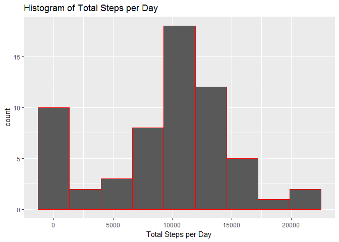
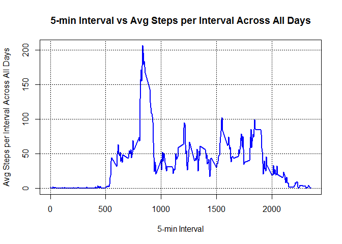
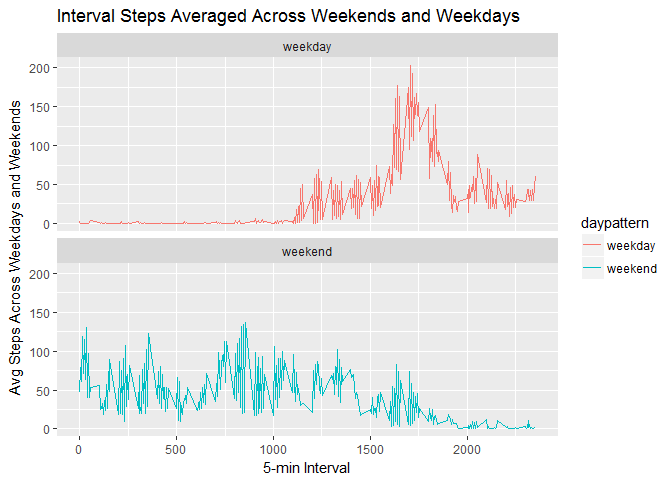

# Reproducible Research: Peer Assessment 1


## Loading and preprocessing the data

```r
activity <- unzip("activity.zip", files = "activity.csv")
activity <- read.csv(activity)
```


```r
str(activity)
```

```
## 'data.frame':	17568 obs. of  3 variables:
##  $ steps   : int  NA NA NA NA NA NA NA NA NA NA ...
##  $ date    : Factor w/ 61 levels "2012-10-01","2012-10-02",..: 1 1 1 1 1 1 1 1 1 1 ...
##  $ interval: int  0 5 10 15 20 25 30 35 40 45 ...
```

```r
head(activity)
```

```
##   steps       date interval
## 1    NA 2012-10-01        0
## 2    NA 2012-10-01        5
## 3    NA 2012-10-01       10
## 4    NA 2012-10-01       15
## 5    NA 2012-10-01       20
## 6    NA 2012-10-01       25
```

```r
head(unique(activity$steps))
```

```
## [1]  NA   0 117   9   4  36
```

```r
tail(unique(activity$interval))
```

```
## [1] 2330 2335 2340 2345 2350 2355
```

```r
## Check percent of NAs in steps
length(activity$steps[is.na(activity$steps)])/length(activity$steps)
```

```
## [1] 0.1311475
```
#### Load useful packages

```r
library(lubridate)
library(ggplot2)
library(tidyr)
library(dplyr)
library(knitr)
```


## What is mean total number of steps taken per day?
#### 1. Calculate the total number of steps taken per day

```r
## Assign days to data set
activity <- mutate(activity, day = 0)

start <- which(activity$interval == 0)
end <- which(activity$interval == 2355)

a <- 1
for(i in 1:length(start)){
    activity$day[start[i]:end[i]] <- a
    a <- a + 1
}

activity$date <- ymd(activity$date)
totdays <- as.numeric(difftime(activity$date[17568], activity$date[1]))

stpday <- data.frame(unique(activity$day), 
                     sapply(split(activity$steps, activity$day), 
                            sum, na.rm = TRUE))

## Assign Names to data frame
names(stpday) <- c("day", "StepsPerDay")
```

#### Answer 1:

```r
stpday
```

```
##    day StepsPerDay
## 1    1           0
## 2    2         126
## 3    3       11352
## 4    4       12116
## 5    5       13294
## 6    6       15420
## 7    7       11015
## 8    8           0
## 9    9       12811
## 10  10        9900
## 11  11       10304
## 12  12       17382
## 13  13       12426
## 14  14       15098
## 15  15       10139
## 16  16       15084
## 17  17       13452
## 18  18       10056
## 19  19       11829
## 20  20       10395
## 21  21        8821
## 22  22       13460
## 23  23        8918
## 24  24        8355
## 25  25        2492
## 26  26        6778
## 27  27       10119
## 28  28       11458
## 29  29        5018
## 30  30        9819
## 31  31       15414
## 32  32           0
## 33  33       10600
## 34  34       10571
## 35  35           0
## 36  36       10439
## 37  37        8334
## 38  38       12883
## 39  39        3219
## 40  40           0
## 41  41           0
## 42  42       12608
## 43  43       10765
## 44  44        7336
## 45  45           0
## 46  46          41
## 47  47        5441
## 48  48       14339
## 49  49       15110
## 50  50        8841
## 51  51        4472
## 52  52       12787
## 53  53       20427
## 54  54       21194
## 55  55       14478
## 56  56       11834
## 57  57       11162
## 58  58       13646
## 59  59       10183
## 60  60        7047
## 61  61           0
```

#### 2. Make a Histogram of total steps per day

```r
qplot(stpday$StepsPerDay, geom = "histogram", bins = 9, 
      col = I("red"), main = "Histogram of Total Steps per Day",
      xlab = "Total Steps per Day")
```

<!-- -->

#### 3. Calculate and report the mean and median total number of steps taken per day

```r
summary(stpday$StepsPerDay)[4]
```

```
## Mean 
## 9354
```

```r
summary(stpday$StepsPerDay)[3]
```

```
## Median 
##  10400
```


## What is the average daily activity pattern?
#### 1. Make a time series plot of the 5-min interval (x-axis) and the average number of steps taken, averaged across all days (y-axis).


```r
activity <- cbind(activity, rep(-1, length(activity$day)))
names(activity)[5] <- "AvgStepPerDay"

for(i in 1:length(stpday$StepsPerDay)){
    activity$AvgStepPerDay[which(activity$day == as.numeric(i))] <- stpday$StepsPerDay[i]
}

avgstepsallint <- data.frame(unique(activity$interval), 
                             sapply(split(activity$steps, activity$interval), 
                                    mean, na.rm = TRUE) )

names(avgstepsallint) <- c("interval", "avgsteps")
## Create Plot
plot(avgstepsallint$interval, avgstepsallint$avgsteps, type = "l",
     main = "5-min Interval vs Avg Steps per Interval Across All Days",
     xlab = "5-min Interval", ylab = "Avg Steps per Interval Across All Days",
     col = "blue", lwd = 2)
grid(nx=NULL, ny=NULL, col="black", lty="dotted")
```

<!-- -->

#### 2. Which 5-minute interval, on average across all the days in the dataset, contains the maximum number of steps?

```r
avgstepsallint[which(avgstepsallint$avgsteps == max(avgstepsallint$avgsteps)), ]
```

```
##     interval avgsteps
## 835      835 206.1698
```


## Imputing missing values
#### 1. Calculate and report the total number of missing values in the dataset (i.e. the total number of rows with NAs)

```r
na.test <- activity[!complete.cases(activity), ]
## Number of rows with NA
length(na.test$steps)
```

```
## [1] 2304
```

```r
## Percent of total
length(na.test$steps)/length(activity$steps)
```

```
## [1] 0.1311475
```

#### 2. Devise a strategy for filling in all of the missing values in the dataset. The strategy does not need to be sophisticated. For example, you could use the mean/median for that day, or the mean for that 5-minute interval, etc.
For filling in the missing values the average value for that day is applied.

#### 3. Create a new dataset that is equal to the original dataset but with the missing data filled in.

```r
activfill <- activity
activfill$steps[is.na(activfill$steps)] <- activfill$AvgStepPerDay[is.na(activfill$steps)]
head(activfill)
```

```
##   steps       date interval day AvgStepPerDay
## 1     0 2012-10-01        0   1             0
## 2     0 2012-10-01        5   1             0
## 3     0 2012-10-01       10   1             0
## 4     0 2012-10-01       15   1             0
## 5     0 2012-10-01       20   1             0
## 6     0 2012-10-01       25   1             0
```

```r
tail(activfill)
```

```
##       steps       date interval day AvgStepPerDay
## 17563     0 2012-11-30     2330  61             0
## 17564     0 2012-11-30     2335  61             0
## 17565     0 2012-11-30     2340  61             0
## 17566     0 2012-11-30     2345  61             0
## 17567     0 2012-11-30     2350  61             0
## 17568     0 2012-11-30     2355  61             0
```

#### 4. Make a histogram of the total number of steps taken each day and Calculate and report the mean and median total number of steps taken per day. Do these values differ from the estimates from the first part of the assignment? What is the impact of imputing missing data on the estimates of the total daily number of steps?


```r
stpday <- data.frame(unique(activfill$day), 
                     sapply(split(activfill$steps, activfill$day), 
                            sum, na.rm = TRUE) )

## Assign Names to data frame
names(stpday) <- c("day", "StepsPerDay")

## Histogram of total steps per day
qplot(stpday$StepsPerDay, geom = "histogram", bins = 9, 
      col = I("red"), main = "Histogram of Total Steps per Day",
      xlab = "Total Steps per Day")
```

<!-- -->

```r
## Calculate and report the mean and median total number of steps taken per day
summary(stpday$StepsPerDay)[4]
```

```
## Mean 
## 9354
```

```r
summary(stpday$StepsPerDay)[3]
```

```
## Median 
##  10400
```
These values do not differ from the estimates at the first part of the assignment
since the average values were all zero.  In this case, the NA values were
removed from the beginning and later they are applied as zeros which doesn't
affect the total daily number of steps. The number of steps for the NA days is 
probably higher than zero thus the calculated averages based upon my methodology
are probably slightly lower than the true average.


## Are there differences in activity patterns between weekdays and weekends?
#### 1. Create a new factor variable in the dataset with two levels - "weekday" and "weekend" indicating whether a given date is a weekday or weekend.

```r
activfill <- mutate(activfill, daypattern = weekdays(activfill$date))

wkend.row <- which(activfill$daypattern == "Saturday" | activfill$daypattern == "Sunday")
activfill$daypattern[wkend.row] <- "weekend" 

wkday.row <- which(activfill$daypattern != "weekend")
activfill$daypattern[wkday.row] <- "weekday"

head(activfill)
```

```
##   steps       date interval day AvgStepPerDay daypattern
## 1     0 2012-10-01        0   1             0    weekday
## 2     0 2012-10-01        5   1             0    weekday
## 3     0 2012-10-01       10   1             0    weekday
## 4     0 2012-10-01       15   1             0    weekday
## 5     0 2012-10-01       20   1             0    weekday
## 6     0 2012-10-01       25   1             0    weekday
```

```r
activfill[which(activfill$daypattern == "weekend")[1:6], ]
```

```
##      steps       date interval day AvgStepPerDay daypattern
## 1441     0 2012-10-06        0   6         15420    weekend
## 1442     0 2012-10-06        5   6         15420    weekend
## 1443     0 2012-10-06       10   6         15420    weekend
## 1444     0 2012-10-06       15   6         15420    weekend
## 1445     0 2012-10-06       20   6         15420    weekend
## 1446     0 2012-10-06       25   6         15420    weekend
```
#### 2. Make a panel plot containing a time series plot of the 5-min interval and the avg number of steps taken, averaged across all weekdays or weekends


```r
int.dpatt <- data.frame(unique(activfill[, c(3, 6)]), 
sapply(split(activfill$steps, list(activfill$daypattern, activfill$interval)), 
mean, na.rm = TRUE))
names(int.dpatt)[3] <- "AvgStepIntDpatt"
## Preview Plot
g <- ggplot(data = int.dpatt, aes(interval, AvgStepIntDpatt, col = daypattern))
g + geom_line() +
facet_wrap(~daypattern, nrow = 2, ncol = 1) +
ggtitle("Interval Steps Averaged Across Weekends and Weekdays") +
xlab("5-min Interval") +
ylab("Avg Steps Across Weekdays and Weekends")
```

<!-- -->
